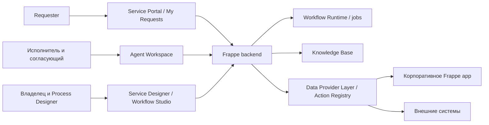
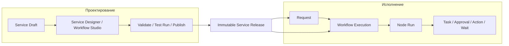

# Архитектура «Единого окна»

Статус: целевая архитектура на основе PRODUCT draft 0.1.
Документ не подтверждает наличие перечисленных механизмов в текущем коде.
[PRODUCT](PRODUCT.md) определяет продукт; [ROADMAP](ROADMAP.md) — порядок реализации.

## System context

Технологическая база — Frappe Framework и Vue 3 / Frappe UI.
На старте логические модули могут оставаться одним Frappe app.
Существующее корпоративное приложение владеет людьми, документами и фактами работы.
[Граница существующего app](docs/architecture/existing-app-boundary.md) исключает независимое дублирование этих данных.

## Design-time и runtime

Редактор создает Workflow Definition. Runtime исполняет опубликованное определение.
Состояние браузера не управляет продолжением Workflow Execution.
Request хранит пользовательский контекст; Workflow Execution хранит техническое исполнение.
[ADR-002](docs/adr/ADR-002-custom-workflow-runtime.md) фиксирует собственный runtime поверх Frappe.
[ADR-003](docs/adr/ADR-003-workflow-definition-format.md) оставляет формат графа открытым до явного решения.

## Основные потоки

| Поток | Граница и основной документ |
|---|---|
| Публикация | Service Draft → validation → snapshot/hash/version → current_release; [Service Release](docs/architecture/service-release.md) |
| Подача Request | Проверка доступа и формы → привязка Service Release → Workflow Execution; [runtime](docs/architecture/workflow-runtime.md) |
| Выполнение Task | Queue → atomic claim → output → продвижение Node; [assignment](docs/architecture/task-assignment.md) |
| Ответ Requester | Безопасное действие → продолжение Request Information; [communications](docs/architecture/communications.md) |
| Получение внешних данных | Reference/prefill → provider → корпоративный объект; [boundary](docs/architecture/existing-app-boundary.md) |
| Внешнее действие | Зарегистрированный Action → защищенный side effect → результат; [integrations](docs/architecture/integrations.md) |
| Публичное чтение | Серверная policy → PublicRequestView → UI; [permissions](docs/architecture/permissions.md) |

## Backend/frontend boundary

Frontend отображает разрешенные данные и помогает вводить корректные значения.
Backend проверяет permissions, форму, состояние и допустимость действия.
Полная Request не передается Requester для скрытия полей на клиенте.
Workflow Studio не выполняет роль engine и не предоставляет произвольный server-side Python.
[Safe projection](docs/architecture/permissions.md) защищает API и другие каналы раскрытия.

## Данные и транзакции

[Доменная модель](docs/architecture/domain-model.md) различает продуктовые сущности и предложенные DocType.
Критичные фильтруемые значения хранятся отдельно от JSON snapshots по принятой схеме конкретного Slice.
Динамические Custom Fields на каждую Service не используются.

Claim, completion, Approval и publish требуют атомарных переходов.
Исходник рекомендует outbox/event pattern для внешних side effects после commit.
Точный механизм пока не утвержден: [runtime](docs/architecture/workflow-runtime.md).
Idempotency hardening в M10 не отменяет защиту повторов в раннем работающем пути.

## Главные инварианты

| Инвариант | Основной источник правила |
|---|---|
| Published Service Release MUST быть immutable | [Service Release](docs/architecture/service-release.md), [ADR-001](docs/adr/ADR-001-service-release-immutability.md) |
| При создании Request система MUST выбрать ровно один Service Release. Request MUST сохранить ссылку на весь срок своей жизни. После создания `Request.service_release` MUST NOT изменяться | [Service Release](docs/architecture/service-release.md), [ADR-001](docs/adr/ADR-001-service-release-immutability.md) |
| Новый Service Release MUST применяться только к новым Request. Редактирование Service или новая публикация MUST NOT менять правила существующей Request | [Service Release](docs/architecture/service-release.md) |
| Workflow Runtime MUST исполнять Request по Service Release, выбранному при ее создании. Он MUST NOT брать правила из Service Draft или текущего `service.current_release` | [Service Release](docs/architecture/service-release.md) |
| Expression Language MUST быть декларативной. Она MUST быть безопасной. Она MUST NOT предоставлять возможность исполнения произвольного server-side Python или другого произвольного кода | [Workflow Definition](docs/architecture/workflow-definition.md#expression-language), [ADR-003](docs/adr/ADR-003-workflow-definition-format.md) |
| Public API строится из safe projection | [Permissions](docs/architecture/permissions.md) |
| Field-level permissions проверяются server-side | [Permissions](docs/architecture/permissions.md) |
| Claim Task атомарен | [Assignment](docs/architecture/task-assignment.md) |
| Автоматический side effect защищен от дублирования | [Runtime](docs/architecture/workflow-runtime.md) |
| Audit append-only; privileged actions audited | [Audit](docs/architecture/audit.md) |
| Public Status не равен внутреннему workflow state | [Состояния](docs/product/statuses.md) |
| Integration secrets не входят в snapshot | [Service Release](docs/architecture/service-release.md) |
| Publish требует полной валидации поддерживаемого профиля | [Definition](docs/architecture/workflow-definition.md), [вопрос раннего профиля](docs/product/service-designer.md) |
| ALL, ANY и N_OF_M сохраняют отдельную семантику | [Каталог Node](docs/architecture/workflow-nodes.md) |

## Подробные документы

| Документ | Что в нем искать |
|---|---|
| [Overview](docs/architecture/overview.md) | Компоненты, надежность, performance, масштаб, observability, риски |
| [Domain model](docs/architecture/domain-model.md) | Предложенные DocType, атрибуты, хранение и удаление |
| [Service Release](docs/architecture/service-release.md) | Snapshot, публикация, версии и неизменяемая связь Request → Service Release |
| [Workflow Definition](docs/architecture/workflow-definition.md) | Граф, expressions и validation |
| [Workflow Runtime](docs/architecture/workflow-runtime.md) | Node Run, транзакции, retries, recovery, trace |
| [Workflow nodes](docs/architecture/workflow-nodes.md) | Контракты Node, Join и коллективного Approval |
| [Dynamic forms](docs/architecture/dynamic-forms.md) | Типы полей, schema, validation и prefill |
| [Task assignment](docs/architecture/task-assignment.md) | Назначение, claim, приоритет и замещение |
| [Permissions](docs/architecture/permissions.md) | ACL, projections, participants, attachments и диагностика |
| [Communications](docs/architecture/communications.md) | Public/Internal, уведомления и Request Information |
| [SLA](docs/architecture/sla.md) | Business Calendar, сроки, паузы и эскалации |
| [Audit](docs/architecture/audit.md) | События, payload и append-only |
| [Integrations](docs/architecture/integrations.md) | API, Domain Events, actions и search |
| [Existing app boundary](docs/architecture/existing-app-boundary.md) | Корпоративные данные и providers |

## Решения и реализация

Accepted ADR фиксирует решение исходника, но не утверждает готовность implementation.
PROPOSED и DECISION REQUIRED нельзя молча превращать в поведение кода.
Решение записывается в основном тематическом документе или ADR; master-документы сохраняют ссылку.
[AGENTS](AGENTS.md) задает STOP rule.
[ExecPlan](.agent/PLANS.md) переводит один Slice в конкретные изменения и тесты.
