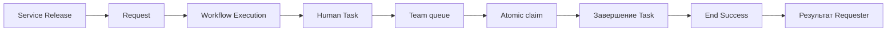

# M01 — Request Happy Path

План разработки. Он не подтверждает готовность текущего приложения.
Бюджеты — оценки объема контекста и проверки, а не сроки.

## Goal

Довести одну простую Service от подачи Request до результата через одну Human Task.

## User Result

Requester отправляет Request, исполнитель забирает Task из Team queue и завершает ее.
Requester видит безопасный статус и результат в той же Request.

## Why Now

Первый срез должен доказать весь путь до результата до появления visual editor и сложных веток.

## Dependencies

[M00](M00-foundation.md) и утвержденные минимальные решения по D-02, D-05, D-07 и D-22.
Для работы нужны Requester, два исполнителя и Team из разрешенной модели identity.

## Scope

Одна тестовая Service, один опубликованный Service Release и небольшая статическая typed form.
Статический Workflow Definition: Start → Human Task → End Success.
Submit, Workflow Execution, Node Run, Team queue, atomic claim, completion и Result Schema.
Safe projection, серверная проверка доступа и аудит критических lifecycle actions входят сразу.
Минимальная защита повторного complete/job должна сохранять согласованность этого пути.
Форма не содержит сложные чувствительные данные, attachments или произвольные expressions.

## Out of Scope

Visual Workflow Studio, полный Service Designer, Approval, Parallel, N_OF_M, расширенный SLA и полный field ACL designer.
Knowledge Base, Subflow, marketplace, AI automation и сложная аналитика не входят.
Реальные внешние side effects не нужны для доказательства этого пути.

## Architecture Involved

[Service Release](../architecture/service-release.md), [runtime](../architecture/workflow-runtime.md), [assignment](../architecture/task-assignment.md), [permissions](../architecture/permissions.md), [audit](../architecture/audit.md).

## Slices

| Slice | Вертикальный результат | Проверка завершения | Budget |
|---|---|---|---|
| M01.1 Минимальная модель | Сохранены Service, Service Release и связанные данные первого сценария | Связи и ограничение immutable проверены; схема взята из утвержденного решения | M |
| M01.2 Тестовая Service | Requester открывает описание и статическую форму | Он видит ожидаемый результат; используется конкретный Service Release | S |
| M01.3 Submit Request | Разрешенный Requester отправляет форму и получает свою Request | Backend валидирует ввод, фиксирует Service Release, исключает чужое чтение | M |
| M01.4 Запуск исполнения | Submit приводит к Start и Human Task | Сохранены Workflow Execution/Node Run; job повтор не создает дубль Task | M |
| M01.5 Team queue | Исполнитель видит созданную Task | Разрешенная Team видит Task; посторонний не получает ее данные | M |
| M01.6 Atomic claim | Один исполнитель становится Assignee | Два конкурентных claim дают одного победителя и один Audit Event | M |
| M01.7 Завершение Task | Assignee сохраняет результат и продвигает workflow | Повторное completion не продвигает граф дважды; чужое действие отвергается | M |
| M01.8 Завершение Request | End Success показывает Requester результат | Public Status и карточка результата соответствуют утвержденному mapping | S |
| M01.9 My Requests | Requester находит созданную Request в своем списке | Список и переход к деталям не раскрывают чужие Request | S |
| M01.10 Устойчивость пути | Тот же путь переживает повтор job и restart worker | Нет потерянной Task, двойного результата и раскрытия runtime details | M |
| M01.11 Сквозная приемка | Сценарий выполняется через UI/API от начала до конца | Зафиксированы успешный путь, concurrency и негативный доступ | M |

Каждый Slice имеет отдельный ExecPlan.
Технические сущности добавляются только в объеме наблюдаемого результата этого пути.
Не расширять M01.4 до общего движка всех Node.

## Acceptance Criteria

1. Requester выбирает тестовую Service и отправляет разрешенные данные.
2. Система создает одну Request с прямой ссылкой на Service Release.
3. Runtime создает Workflow Execution, Node Run и Task в нужной Team queue.
4. При конкурентном claim только один исполнитель становится Assignee.
5. Assignee сохраняет результат и завершает Task.
6. Runtime достигает End Success без двойного продвижения.
7. Requester видит результат и «Завершена» в исходной Request.
8. Посторонний пользователь не читает Request и не выполняет Task.
9. API Requester не содержит Internal Note, технических payload и закрытых данных.
10. Изменение Service Draft/current_release не меняет правила уже созданной Request.

## Required Tests

- Integration: сохранение цепочки Service Release → Request → Workflow Execution → Node Run → Task.
- Concurrency: два независимых claim одной Task; один успешный audit event.
- Permission: чужой Requester, посторонняя Team, completion неуполномоченным пользователем.
- Idempotency: повтор job и повтор completion без дополнительной Task или End.
- Recovery: worker restart между сохраненным состоянием и следующей работой.
- Projection: публичный API возвращает только разрешенные данные.
- End-to-end: весь happy path с реальным сохранением, а не только экранным mock.

Исходник не задает поведение повторного submit. Этот план не вводит автоматическое объединение повторно поданных Request.

## AI Budget

XL. Нельзя поручать как одну AI-задачу; выполнять M01.1–M01.11 отдельно.

## Exit Criteria

Сквозной сценарий проходит от выбора Service до результата Requester.
Concurrency, permissions и повторная доставка проверены.
Нет скрытой зависимости от открытого Workflow Studio.
Дефекты, нарушающие инварианты пути, устранены; M01 не объявляется полным MVP.

## Known Risks

Попытка построить все Node при первом запуске runtime раздует scope.
Отложенная до M07 безопасность сделает ранний путь неприемлемым.
Полный checklist публикации нельзя заменить фиктивным успешным результатом.

## Decision Required

[D-02](../product/statuses.md): используемые переходы и Public Status.
[D-05](../product/service-designer.md): ограниченный профиль раннего Service Release.
[D-07](../architecture/domain-model.md): минимальные DocType.
[D-22](../adr/ADR-003-workflow-definition-format.md): формат статического графа.
Нужно уточнить протокол повторного complete и постановки работы в [runtime](../architecture/workflow-runtime.md).
При неутвержденном решении агент останавливает зависимый Slice, а не выбирает семантику молча.

[Общий ROADMAP](../../ROADMAP.md) · [Правила ExecPlan](../../.agent/PLANS.md)
