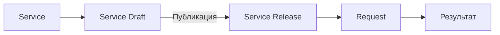

# Модель Service

Основание: исходный PRODUCT draft 0.1, разделы 2, 7, 30, 32–33, 39–40.


## Контракт Service

Service описывает результат, который организация предоставляет Requester.
Она определяет аудиторию, входные данные, workflow, исполнителей, согласования, доступ, SLA, коммуникации и владельцев.
Связанные знания помогают получить результат и выполнить внутренние Task.

Service сохраняет логическую идентичность между публикациями.
Service Draft хранит редактируемую работу владельца услуги.
Service Release фиксирует исполняемые правила.



В Service Draft можно менять форму, workflow, тексты, SLA, права, уведомления, исполнителей и интеграции.
Эти изменения не влияют на опубликованный Service Release.
Правила публикации и неизменяемости находятся в [Service Release](../architecture/service-release.md).

## Жизненный цикл

```text
Service Draft → проверка готовности → публикация Service Release N
             → редактирование Service Draft → публикация Service Release N+1
```

Service Release N остается доступен для исполнения старых Request.
Archive Service запрещает создание новых Request и не останавливает старые.
[Справочник состояний](statuses.md) отделяет состояния Service от обозначений этапов подготовки.

## Результат

Каждая Service MUST иметь Result Schema.
Requester получает результат в понятной карточке.
UI не обязан показывать исходный JSON.

Примеры из исходника:

```json
{"granted": true, "system": "CRM", "role": "Sales", "valid_until": null}
```

```json
{"document_id": "DOC-00123", "attachment": "..."}
```

```json
{"purchase_request": "PR-0042", "status": "created"}
```

Это примеры результатов доступа, документа и закупки. Они не задают общую обязательную схему.
Правила раскрытия результата описаны в [permissions](../architecture/permissions.md).

## Зависимости Service

После MVP Service может вызывать другую Service через child request.
Пример: onboarding включает доступ, оборудование и пропуск.
Requester при этом видит один master Request.

Для MVP исходник рекомендует Subflow вместо полноценной модели child request.
При этом список обязательных Node MVP не включает Subflow.
Граница этой возможности требует решения D-03 в [каталоге Node](../architecture/workflow-nodes.md).

Уже запущенные Request по умолчанию не мигрируют между Service Release.
Будущее исключение Migrate Execution описано в [модели Service Release](../architecture/service-release.md).
